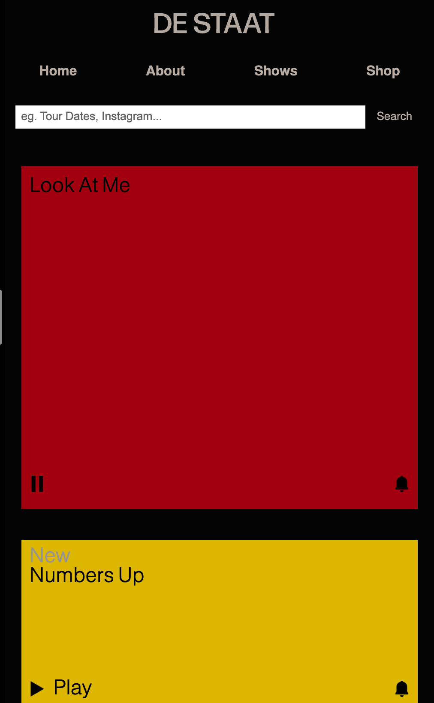

## Howdy, FED!

uitwerken voor kick-off werkgroep

### Auteur:
Eva Boogaard

#### Je startniveau:
Rood but trying to be Zwart someday

#### Je focus:
Surface Plane & Responsive

## Je website

### Je opdracht:
https://www.destaat.net/

#### Screenshot(s) van de eerste pagina (small screen): 
Homepage 

#### Screenshot(s) van de tweede pagina (small screen):
Detailpage

 

## Breakdownschets (week 1)

### de hele pagina: 

## Voortgang 1 (week 2)

uitwerken voor 1e voortgang

### Stand van zaken
Het ging best wel goed, ik had moeite met javascript & beetje met height en width, maar ben er wel uitgekomen.

### Agenda voor meeting
samen met je groepje opstellen

| Heba           | Eva                | student 3    | student 4        |
| ---            | ---                | ---          | ---              |
| nav met javascr| javascript doet    | breakdown    | en dan ik dat    |
| en dat ook nog | het niet op github | schetsbestand| dit wil ik zeker |
| ...            |                    | te groot     | ...              |

### Verslag van meeting
hier na afloop snel de uitkomsten van de meeting vastleggen

ik was dom aan het doen en de js file kijkt natuurlijk vanuit de dom, which means dat als je een source gaat aanroepen, je niet ../ moet gebruiken, want dan gaat hij het zoeken in een map die te hoog ligt.

## Voortgang 2 (week 3)

uitwerken voor 2e voortgang

### Stand van zaken
Ik heb gestruggled met het stuk aan het begin, met de 3 singles, deze heb ik eerst van flexbox naar grid omgezet maar toen toch weer niet, ik kwam er later pas achter dat als je met JS een class toevoegt, deze pas de vorige waarde overschrijft als je een net zo specifieke selector aanroept. Maar met bloed, zweet en tranen ben ik er wel uitgekomen. 

Ik heb gespeeld met media queries, ik ben begonnen met het responsive maken van een aantal elementen en ik heb een dark-mode toegevoegd. Ook heb ik geprobeerd een beginnetje te maken met de toegankelijkheid van de website, maar daar valt nog veel te halen.

### Agenda voor meeting
samen met je groepje opstellen

| student 1      | student 2          | student 3    | student 4        |
| ---            | ---                | ---          | ---              |
| dit bespreken  | en dit             | en ik dit    | en dan ik dat    |
| en dat ook nog | dit als er tijd is | nog een punt | dit wil ik zeker |
| ...            | ...                | ...          | ...              |

### Verslag van meeting
hier na afloop snel de uitkomsten van de meeting vastleggen

- Zaid en Sasja zijn toppers en ze verdienen allebei een raise
- Zaid kwam met het punt dat de heading-levels als een soort receptenboek zijn: H1 is de titel van het recept, H2 de ingrediëntenlijst, H3 de benodigdheden, etc.etc. dus dat heb ik aangepast.
- Het was gezellig en we hadden thee. #BestieVibes

## Toegankelijkheidstest (week 4)

uitwerken na test in 8e voortgang

### Bevindingen
Lijst met je bevindingen die in de test naar voren kwamen:

#### Er moet een high contrast mode komen
In de werkgroep heb ik ondervonden dat sommige elementen in de site geen hoog genoeg contrast hebben, dat had ik niet zo door aangezien mijn ogen nog prima werken.

Dit kan gefixt worden d.m.v. een media query waarin de root kleurtjes aangepast worden.

#### Heading levels werken niet zoals Zaid ze beschrijft
Technisch gezien hoort het zo te werken dat als je een H1 in een section zet - deze zich onderscheidt van de andere H1. Bij het gebruik van een screenreader is er echter geen touw aan vast te knopen, het is pure chaos, help.

Ik moet kortgezegd alle heading levels weer aanpassen naar hoe ze eerst waren - dus hierarchie gebaseerd op hoe belangrijk de headings zijn.

#### Links worden niet goed voorgelezen
Sommige linkjes worden met gebruik van de screenreader niet goed voorgelezen omdat ik dacht dat ik lekker semantisch bezig was maar dat viel heerlijk tegen.

Ik heb nu geen tijd meer om zo'n groot deel van mijn code te herschrijven, helaas, maar in de toekomst zal ik de screenreader veel meer in mijn achterhoofd houden terwijl ik aan het werk ben en zal ik deze testen, net zoals ik mijn website constant aan het testen ben. Op deze manier zal je niet last-minute nog voor verrassingen komen te staan.

#### Tabindex = not gr8
Ik had in eerste instantie gebruik gemaakt van tabindex, omdat ik dacht 'wauwie wat handig' maar dat was een stuk minder 'wauwie wat handig' en meer een niet-werkende lifehack. 

Dus ik heb maar heel snel al mijn tabindex-jes uit de html geknald, want die hebben daar niets te zoeken.

#### Niks werkt zoals het zou moeten werken
Ik heb in een super coole, mega populaire podcast geleerd dat alle 'best practices' over accessible design eigenlijk nergens op slaan. De tab-key wordt vaak niet gebruikt omdat focus gebroken is - omdat bedrijven er geen tijd, zin, of geld in willen steken. 'Normale' mensen weten niet wat een heading level is - en waarom zouden ze dit ook moeten weten? In conclusie, mijn website is echt niet toegankelijk genoeg, maar wel toegankelijker dan de meesten. Hopelijk mag ik het moment nog meemaken dat er een praktische, universele oplossing komt voor het toegankelijkheidsprobleem binnen het web.

## Voortgang 3 (week 4)

uitwerken voor 3e voortgang

### Stand van zaken
Eerlijk, ik ben gewoon aan het chillen. No stress. Only vibes. <3

### Agenda voor meeting
Heba -> vraag over tabben en a tags
Maily -> vraag over responsiveness
Eva -> hoe uitgebreid moet alt tekst zijn? En hoe groot/klein moet een scherm kunnen zijn?

### Verslag van meeting
Alt tekst weglaten behalve als de image een link is -> anders wordt de link niet duidelijk voorgelezen.
240px zou keihard zijn maar 320px is een gangbaar formaat. Grote schermen zijn lastig. Maar niet persé fout te doen, volgens mij.

## Eindgesprek (week 5)

uitwerken voor eindgesprek

### Stand van zaken
Ik ben sip dat het voorbij is en ik wou dat ik opnieuw kon beginnen met de kennis die ik nu heb, maar ik ben uiteindelijk heel blij met het resultaat! Het heeft me zo'n 1.4% minder onzeker gemaakt over mijn code-skills dus dat telt als een win in mijn boek.

### Screenshot(s)

hier screenshot(s) van je eindresultaat

## Bronnenlijst

continu bijhouden terwijl je werkt

1. One source to rule them all: https://www.vasilis.nl/

2. https://developer.mozilla.org/en-US/docs/Web/CSS/grid-column?retiredLocale=nl
3. https://newbedev.com/show-hide-elements-with-animation
4. https://www.digitalocean.com/community/tutorials/code-formatting-with-prettier-in-visual-studio-code
5. https://stackoverflow.com/questions/35856013/rotate-all-html-element-whole-page-90-degree-with-css
6. https://stackoverflow.com/questions/2943548/how-to-reset-remove-chromes-input-highlighting-focus-border
7. https://www.smokonow.com/
8. https://developer.mozilla.org/en-US/docs/Web/CSS/text-decoration-thickness
9. https://stackoverflow.com/questions/45926475/naming-html-section-ids
10. https://developer.mozilla.org/en-US/docs/Web/CSS/Specificity
11. https://stackoverflow.com/questions/45536537/centering-in-css-grid
12. https://dlo.mijnhva.nl/d2l/le/content/324289/Home
13. https://developer.mozilla.org/en-US/docs/Web/CSS/transform-function/rotateZ()
14. https://stackoverflow.com/questions/35856013/rotate-all-html-element-whole-page-90-degree-with-css
15. https://stackoverflow.com/questions/2943548/how-to-reset-remove-chromes-input-highlighting-focus-border
16. https://stackoverflow.com/questions/27144702/how-to-reset-display-property-for-flex-item
17. https://www.quackit.com/css/functions/css_rotate_function.cfm
18. https://developer.mozilla.org/en-US/docs/Web/CSS/filter-function/brightness()
19. Mijn eigen brein

